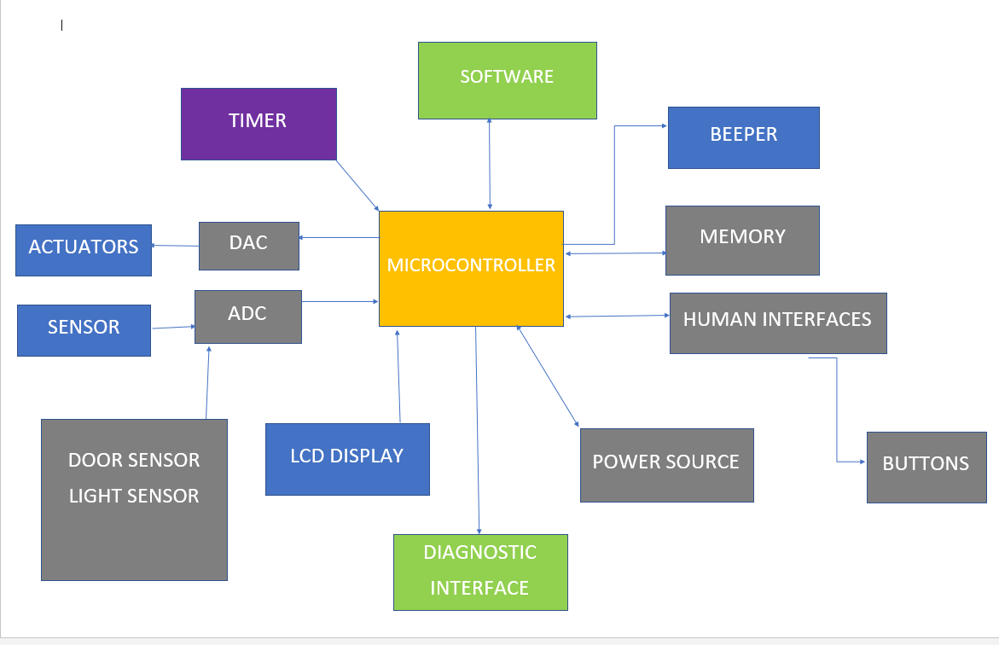

# Case_Study_Microwave
## Low level Requirements
- Start/Stop button
- Timer 
- Restart option
- Different option for types of food to cook
- Temprature option

## High level Requirements
- Oven should work only with door closed
- All operations will be stopped once the door is open
- Minimum timer setting should be 10 seconds
- Maximum an oven can for 100 minutes continously
- Minimum/Maximum temprature

## Aplications
- We can bake food
- We can pre heat the food
- We can cook processed food
- We can roast food

## Block Diagram

## Components
- Buttons: To give instructions (Start, Stop, Time, Temprature)
- Timer: To set time
- Sensor: To sense whether the door is open or close and stop when the door is open. To turn on the light when microwave is working
- Beeper: To alert the user when the food is ready
- Display: To display the instruction selected
- Actuator: To convert the current into electromagnetic waves

